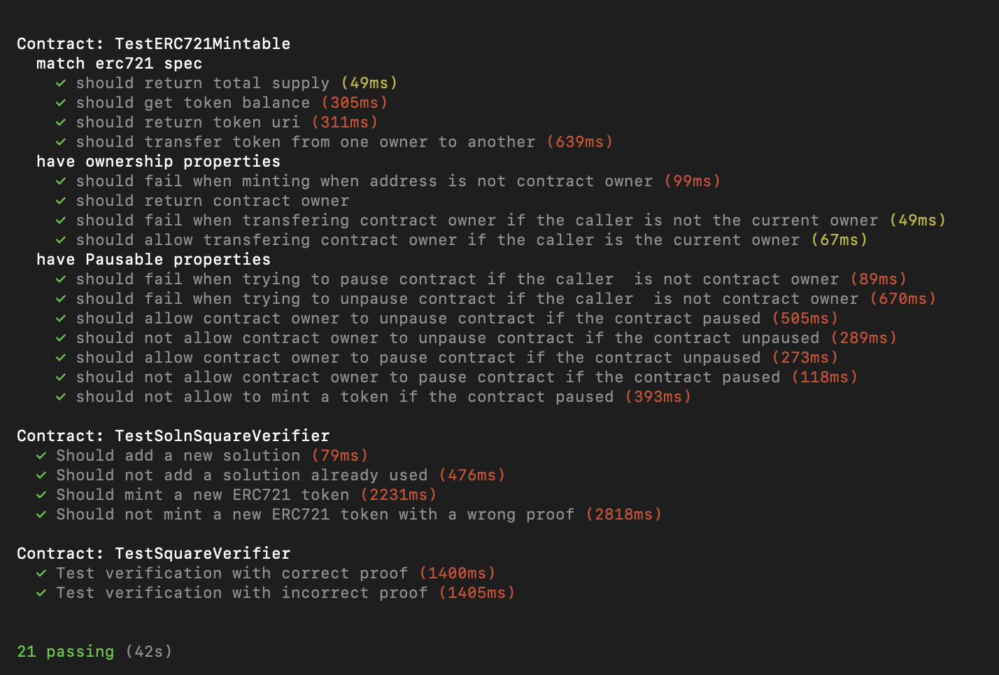
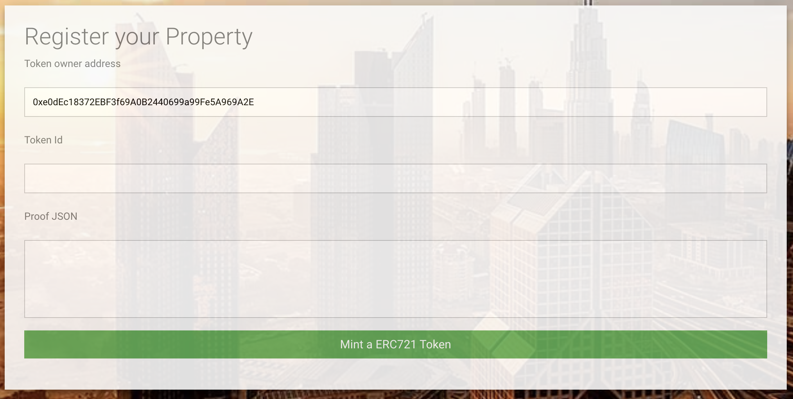

# Blockchain Capstone: Real Estate Marketplace

Blockchain Capstone: Real Estate Marketplace is the final project for Udacity's Blockchain NanoDegree course.

This application allows you to mint your own tokens to represent your title to the properties. Before you mint a token, you need to verify you own the property. You will use zk-SNARKs to create a verification system which can prove you have title to the property without revealing that specific information on the property.  Once the token has been verified and minted, it will be placed on a blockchain market place (OpenSea) for others to purchase.

A User Interface has been provided in order to make it easy to minting tokens. The application front-end runs on the client's machine, powered by a lite-server. Using web3/metamask , it communicates with the deployed smart contract in the Ethereum Rinkeby Netword.

## Contract addresses on the Rinkeby test network
### 1. Verifier 
```
  > transaction hash:    0x373cacd5173814471fa5606affb6ce67e89a32ebf67800281303a7c9262a8571
   > Blocks: 0            Seconds: 8
   > contract address:    0x1244BD65605bAd3381F6577e702290ed9dFa429d
   > block number:        5174943
   > block timestamp:     1569763113
   > account:             0xe0dEc18372EBF3f69A0B2440699a99Fe5A969A2E
```

#### 2. SolnSquareVerifier
```
> transaction hash:    0xda91592f5a7cd5a7118a469a4c97c5fd783cbf6bf7b1e2dbc03f02fa5bc25bb1
   > Blocks: 0            Seconds: 8
   > contract address:    0xe42B475Fd8Fbf272E66804d4e4f4753fF08C9de3
   > block number:        5174945
   > block timestamp:     1569763143
   > account:             0xe0dEc18372EBF3f69A0B2440699a99Fe5A969A2E
  
```

## Contract ABI
 Contract ABI can be found on `eth-contracts/build/contracts` folder on github repository
 
## OpenSea MarketPlace Storefront link
- Original minter : https://rinkeby.opensea.io/accounts/0xe0dEc18372EBF3f69A0B2440699a99Fe5A969A2E?tab=activity
- Buyer 1 : https://rinkeby.opensea.io/accounts/0x202E860B580D2F8A9Acc9228368F9f4Bebb46C88?tab=activity
- Buyer 2 : https://rinkeby.opensea.io/accounts/0xeEA62768e2fBC67C00Fe8129351ae0d391b608f6?tab=activity

# Getting Started

## Libraries

* Truffle v5.0.25 (core: 5.0.25)
* Solidity v0.5.0 (solc-js)
* Node v10.15.3
* Web3.js v1.0.0-beta.37

## Install
1. Clone this repository
```
git clone https://github.com/Abderrazzak87/Blockchain-Capstone.git
```
2. Install all requisite npm packages:
```
cd Blockchain-Capstone
npm init
npm install
npm install truffle-assertions
```

## Run Tests
1. Launch ganache

```
ganache-cli
```
2. Update truffle.js
* Update ligne 2 and ligne 8 with your ganache **MNEMONIC** and **RPC SERVER** in the truffle.js in eth-contracts/config/

3. In a separate terminal window, compile smart contracts:
```
cd eth-contracts
truffle compile
```
4. Run the test command
```
truffle test 
```



## Deploying in the Rinkeby test network

1. Update truffle.js
* Update ligne 2 and ligne 3 with your ethereum wallet **MNEMONIC** and **INFURA API KEY** in the truffle.js in eth-contracts/config/

2. In a separate terminal window, Compile smart contracts:
```
cd eth-contracts
truffle compile
```

3. Deploy in the Rinkeby test network with truffle
```
truffle migrate --network rinkeby
```

## Mint Token with UI

In the same (or a new terminal) launch the dapp
```
npm run dev
```
To mint a token, the token owner address, the Token id and the proprety proof (JSON format) are needed.



## Generating the proof from zokrates
1. Navigate to project folder
` cd Blockchain-Capstone\zokrates\code\`

2. Run the zokrates docker image
`docker run -v $(pwd):/home/zokrates/code -ti zokrates/zokrates:0.3.0 /bin/bash`

3. Compile the program 
```
cd code
~/zokrates compile -i square/square.code
```

4. Generate the trusted setup
`~/zokrates setup`

5. Compute witness for your desired pair of number - square (the project already contains proof for [3,9] , [4-16] squares)
`~/zokrates compute-witness -a number square`

6. Generate proof
`~/zokrates generate-proof` At this point there should be a proof.json file. The content of this file can be used in the UI by copy/past


# Project Resources

* [Remix - Solidity IDE](https://remix.ethereum.org/)
* [Visual Studio Code](https://code.visualstudio.com/)
* [Truffle Framework](https://truffleframework.com/)
* [Ganache - One Click Blockchain](https://truffleframework.com/ganache)
* [Open Zeppelin ](https://openzeppelin.org/)
* [Interactive zero knowledge 3-colorability demonstration](http://web.mit.edu/~ezyang/Public/graph/svg.html)
* [Docker](https://docs.docker.com/install/)
* [ZoKrates](https://github.com/Zokrates/ZoKrates)

# Authors

* Abderrazzak BENABDALLAH

# License

The contents of this repository are covered under the [MIT License](LICENSE).
